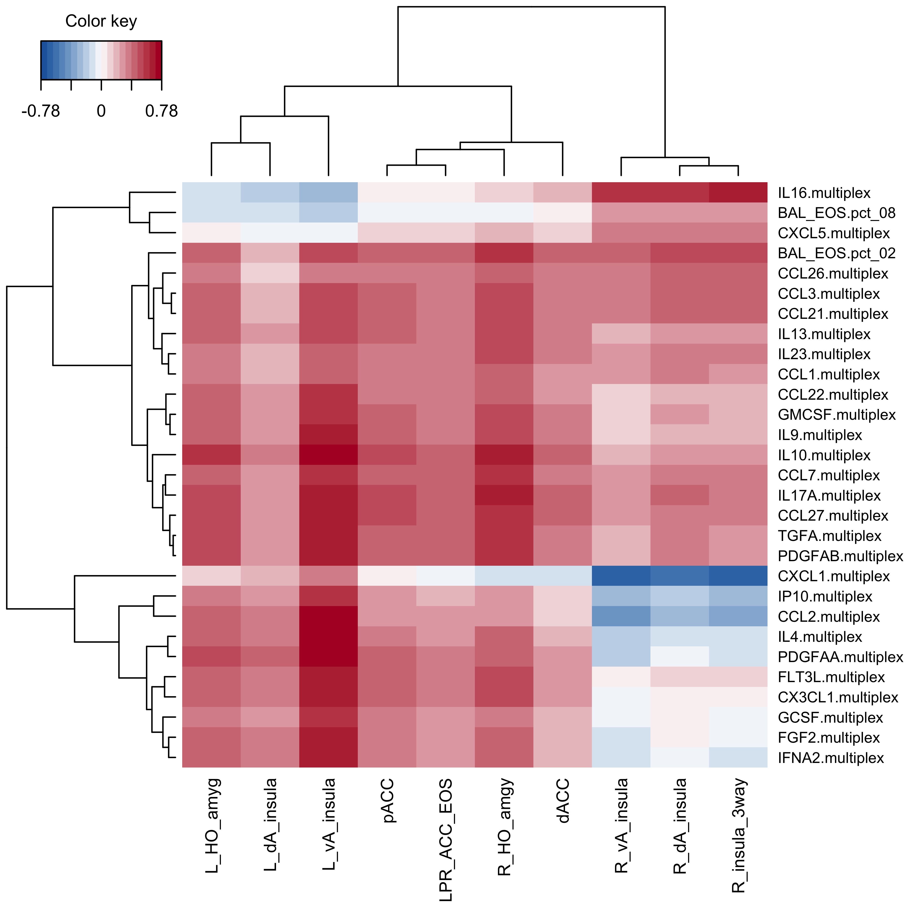

# Background

The purpose of this workflow is to associate gene module expression (EOS, PMN) with host outcomes including:

* fMRI
* Lung function / asthma
* Protein

# Setup

Load packages

```{r message=FALSE, warning=FALSE}
# Data manipulation and figures
library(tidyverse)
library(readxl)
library(cowplot)
library(tidytext)
# RNAseq data
library(limma)
#Correlation
library(corrplot)
#PLS
library(mixOmics)
# Print tty table to knit file
library(knitr)
library(kableExtra)
options(knitr.kable.NA = '')

`%notin%` <- Negate(`%in%`)
```

Set seed

```{r}
set.seed(4389)
```

Load functions

```{r}
source("scripts/corr.fxn.R")
```

# Load data

```{r}
load("data_clean/P337_BAL_data.RData")
```

# Format data

## Calculate V5 - V4

When applicable, correlations will be completed for delta values (V5-V4) to capture the paired nature of these data.

#### Module expression

Two donors are removed from BE expression data (MA1001 missing V4, MA1086 missing V5).

```{r}
#Read in all module expression
mod.files <- list.files(path="results/module_level/", pattern="mod_voom_counts",
                        recursive = TRUE, full.names = TRUE)

counts.mod <- data.frame()
for(file in mod.files){
  counts.temp <- read_csv(file) %>% 
    pivot_longer(-c(module,module.char), names_to="libID")
  
  counts.mod <- rbind(counts.mod, counts.temp)
}

#Calculate delta
counts.mod.delta <- counts.mod %>% 
  #Remove modules 00
  filter(!grepl("_00",module)) %>% 
  dplyr::select(-module.char) %>% 
  #Add metadata to denote V4, V5
  full_join(dplyr::select(dat.BAL.abund.norm.voom$targets, 
                   libID, donorID, visit), by = "libID") %>% 
  #separate V4 and V5
  dplyr::select(-libID) %>% 
  pivot_wider(names_from = visit) %>% 
  mutate(delta = V5-V4) %>% 
  #shorten module names
  mutate(module=gsub("module_P337_", "", module)) %>% 
  #wide format
  dplyr::select(-V4,-V5) %>% 
  arrange(donorID, module) %>% 
  pivot_wider(names_from = module, values_from = delta)
```

#### Cytokine protein

```{r}
plex.delta <- read_csv("data_raw/addtl.data/P337_BAL.multiplex.csv") %>% 
  rename(donorID=ptID, FGF2_V4=TGF2_V4) %>% 
  pivot_longer(-donorID) %>% 
  #Log10 transform
  mutate(value = ifelse(value==0,0, log10(value))) %>% 
  separate(name, into=c("name","visit"), sep="_") %>% 
  pivot_wider(names_from = visit) %>% 
  mutate(delta = V5-V4) %>% 
  drop_na(delta) %>% 
  dplyr::select(-V4,-V5) %>% 
  arrange(name) %>% 
  mutate(name = paste(name, "multiplex", sep=".")) %>% 
  pivot_wider(values_from = delta) 
```

Check if cytokine genes are in expression modules as well.

```{r include=FALSE}
#List cytokines in multiplex data
cyto <- data.frame(cyto = gsub(".multiplex","", colnames(plex.delta)[-1]))

#Find cytokine gene names
key <- read_tsv("data_raw/EnsemblToHGNC_GRCh38.txt")
cyto %>% filter(cyto %notin% key$hgnc_symbol)

#change to gene names where needed
cyto.rename <- cyto %>% 
  mutate(gene = recode(cyto,
                       "FLT3L"="FLT3LG",
                       "GCSF"="CSF3",
                       "GMCSF"="CSF2",
                       "IL12p70"="IL12A_IL12B",
                       "IL1RA"="IL1RN",
                       "IL23"="IL23A",
                       "IL8"="CXCL8",
                       "IP10"="CXCL10",
                       "PDGFAA"="PDGFA",
                       "PDGFAB"="PDGFA_PDGFB",
                       "RANTES"="CCL5",
                       "sCD40L"="CD40LG",
                       "TARC"="CCL17",
                       "TNFA"="TNF",
                       "TNFB"="LTA",
                       "VEGF"="VEGFA_VEGFB_VEGFC")) %>% 
  #Unnest multi-annotations
  separate(gene, into=c("a","b","c"), sep="_") %>% 
  pivot_longer(a:c, values_to = "gene") %>% 
  drop_na(gene) %>% 
  dplyr::select(-name)

#Check all renamed cytokines in key
table(cyto.rename$gene %in% key$hgnc_symbol)
```

```{r echo=FALSE, message=FALSE}
#genes in modules, PMN
temp <- read_csv("results/module_level/module_P337_BAL_PMN.pct_deepSplit2_minMod50/P337_BAL_PMN.pct_genes_in_mod.csv") %>% 
  inner_join(cyto.rename, c("hgnc_symbol"="gene")) %>% 
  mutate(module = paste("PMN", module.char, sep="_")) %>% 
  dplyr::select(module, hgnc_symbol, cyto) %>% 
  arrange(module, cyto)

#genes in modules, EOS
read_csv("results/module_level/module_P337_BAL_EOS.pct_deepSplit2_minMod50/P337_BAL_EOS.pct_genes_in_mod.csv") %>% 
  inner_join(cyto.rename, c("hgnc_symbol"="gene")) %>% 
  mutate(module = paste("EOS", module.char, sep="_")) %>% 
  dplyr::select(module, hgnc_symbol, cyto) %>% 
  arrange(module, cyto) %>% 
  bind_rows(temp) %>% 
  
  
  kable(align="c", col.names = c("Module", "Gene HGNC", 
                                 "Cytokine")) %>% 
  kable_styling(bootstrap_options = "striped", full_width = FALSE) %>% 
  collapse_rows(1, valign="top")
```

#### fMRI

Donor MA1012 is removed due to movement issues in fMRI.

```{r message=FALSE}
#Time point 1 = visit 4
neuro <- read_excel(sheet="T1",
  "data_raw/addtl.data/extraced.clusters.Matt.Altman_wbaseline_psychdata.xlsx") %>% 
  #long format
  pivot_longer(-idnum, names_to="neuro") %>% 
  #add visit variable
  mutate(visit="V4")

#Time point 2 = visit 5
neuro <- read_excel(sheet="T2",
  "data_raw/addtl.data/extraced.clusters.Matt.Altman_wbaseline_psychdata.xlsx") %>% 
  #long format
  pivot_longer(-idnum, names_to="neuro") %>% 
  #add visit variable
  mutate(visit="V5") %>% 
  #Combine with other visit
  full_join(neuro) %>% 
  #Format idnum to match RNAseq data
  mutate(idnum = paste("MA",idnum, sep="")) %>% 
  rename(donorID=idnum)

neuro.delta <- neuro %>% 
  filter(donorID != "MA1012" & neuro != "LSI" & neuro != "BDI") %>% 
  #Calculate delta
  pivot_wider(names_from = visit) %>% 
  mutate(delta = V5-V4) %>% 
  #wide format
  dplyr::select(-V4,-V5) %>% 
  pivot_wider(names_from = neuro, values_from = delta)
```

#### Lung function and asthma

```{r}
asthma.delta <- dat.BAL.abund.norm.voom$targets %>% 
  dplyr::select(donorID, FEV1.pctPP.preAlbuterol_V4:FeNO.PreBro_V5) %>% 
  distinct() %>% 
  #get visit from variable names
  pivot_longer(-donorID) %>% 
  separate(name, into=c("asthma","visit"), sep="_") %>% 
  #Calculate delta
  pivot_wider(names_from = visit) %>% 
  mutate(delta = V5-V4) %>% 
  #Wide format
  dplyr::select(-V4,-V5) %>% 
  pivot_wider(names_from = asthma, values_from = delta)
```

# Partial least squares (PLS)

Regression mode: Y matrix is deflated with respect to information extracted/modeled from local regression on X. Here, the goal is to predict Y from X (and vice versa).

Sparse: simultaneous variable selection in X and Y with LASSO penalization on each pair of loading vectors

<http://mixomics.org/methods/spls/>

## fMRI ~ module expression + cytokine protein

Format data

```{r}
X <- counts.mod.delta %>% 
  filter(donorID %in% neuro.delta$donorID) %>% 
  full_join(plex.delta) %>% 
  column_to_rownames("donorID")
X <- X[complete.cases(X),]
 
Y <- neuro.delta %>% 
  filter(donorID %in% rownames(X)) %>% 
  column_to_rownames("donorID")
```

Perform PLS regression.

```{r}
ncomp = 10
#PLS
pls <- pls(X, Y, ncomp = ncomp, mode = "regression")  

#SPLS
spls <- spls(X, Y, ncomp = ncomp, mode = "regression")  
```

### Tuning

#### Number of components

Compute evaluation criteria for (S)PLS.

```{r}
pls.Q2 <- perf(pls, validation = "Mfold", folds = 10, nrepeat = 100,
               progressBar = FALSE)

spls.Q2 <- perf(spls, validation = "Mfold", folds = 10, nrepeat = 100,
                progressBar = FALSE)
```

Q2 total is the sum of the quality of fit over all variables. In general, components should only continue to be added if Q2 \< 0.0975 (red line). After that, there are diminishing returns to adding more components. Here, we would need to retain too many components by this general rule.

```{r echo=FALSE}
mutate(as.data.frame(pls.Q2$Q2.total), method="PLS") %>% 
  bind_rows(mutate(as.data.frame(spls.Q2$Q2.total), method="SPLS")) %>% 
   mutate(Component = c(1:ncomp,1:ncomp)) %>% 

  ggplot(aes(x=Component, y=Q2.total)) +
  geom_point() +
  geom_hline(yintercept = 0.0975, color="red") +
  facet_wrap(~method) +
  theme_classic()
```

Thus, axis loadings will be assessed as well. Looking at the axis loadings (same for PLS and SPLS), component 1 explains the most variation (\~40%) in X with further components contributing to a lesser extent (\<10%). Y shows more even contributions from components 1-3 being \> 25%.

```{r echo=FALSE}
#axis loadings
as.data.frame(pls$explained_variance)%>% 
  mutate(Component = c(1:ncomp)) %>% 
  pivot_longer(X:Y, names_to = "space") %>% 
  
  ggplot(aes(x=Component, y=value)) +
  geom_point() +
  facet_wrap(~space) +
  theme_bw() +
  labs(y="Loading")
```

```{r echo=FALSE}
ncompX <- 2
ncompY <- 3
```

Taken together, `r ncompX` X and `r ncompY` Y components will be used.

#### Number of variables

Compute mean absolute values (MAE) for variables on each component. (Only SPLS is assessed from this point).

```{r eval=FALSE}
#X variables
spls.MAE.X <- tune.spls(X, Y, 
                        ncomp = ncompX, #Determined above
                        test.keepX = c(2:30, 40),
                        validation = "Mfold", 
                        folds = 10, nrepeat = 100, 
                        progressBar = FALSE, 
                        measure = 'MAE')
#Y variables
spls.MAE.Y <- tune.spls(Y, X,
                        ncomp = ncompY, #Determined above
                        test.keepX = c(2:10),
                        validation = "Mfold", 
                        folds = 10, nrepeat = 10, 
                        progressBar = FALSE, 
                        measure = 'MAE')

#Save
dir.create("results/PLS/", showWarnings = FALSE)
save(spls.MAE.X, spls.MAE.Y,
     file="results/PLS/MAE.RData")
```

```{r echo=FALSE, results=FALSE}
#Load in saved MAE to speed Rmd
load("results/PLS/MAE.RData")
```

```{r echo=FALSE}
plot(spls.MAE.X, legend.position = 'topright')
plot(spls.MAE.Y, legend.position = 'topright')
```

Based on minimum MAE, the number of variables to keep per component is

```{r echo=FALSE}
data.frame( var = c(rep("X", ncompX), rep("Y", ncompY)),
            comp = c(1:ncompX,1:ncompY),
            keep = c(spls.MAE.X$choice.keepX, spls.MAE.Y$choice.keepX) ) %>% 
  
  kable(align="c", col.names = c("Space", "Component", 
                                 "No. to keep")) %>% 
  kable_styling(bootstrap_options = "striped", full_width = FALSE) %>% 
  collapse_rows(1, valign="top")
```

### Run (S)PLS

Using the parameters determined above, run the final (S)PLS regression. `r ncompX` components will be used based on tuning X.

```{r}
result.spls <- spls(X,Y, 
                    keepX = spls.MAE.X$choice.keepX,
                    keepY = spls.MAE.Y$choice.keepX,
                    ncomp = ncompX, mode = "regression")  
```

This results in the following variables across 2 components.

```{r echo=FALSE}
load <- as.data.frame(result.spls$loadings$X) %>% 
  rownames_to_column("var") %>% 
  mutate(space="X")

as.data.frame(result.spls$loadings$Y) %>% 
  rownames_to_column("var") %>% 
  mutate(space="Y") %>% 
  bind_rows(load) %>% 
  pivot_longer(comp1:comp2) %>% 
  mutate(name = recode(name, 
                       "comp1"=paste("Component 1 \n X=",
                                     round(result.spls$explained_variance$X[1]*100,
                                           digits=1), "%, Y=",
                                     round(result.spls$explained_variance$Y[1]*100,
                                           digits=1),
                                     "%", sep=""),
                       "comp2" = paste("Component 1 \n X=",
                                     round(result.spls$explained_variance$X[2]*100,
                                           digits=1), "%, Y=",
                                     round(result.spls$explained_variance$Y[2]*100,
                                           digits=1),
                                     "%", sep=""))) %>% 
  filter(value != 0) %>% 
  
  ggplot(aes(x=reorder_within(var, -value, space), 
             y=value, fill=name)) +
  geom_bar(position = position_dodge2(width = 0.9, preserve = "single"),
           stat="identity") +
  scale_x_reordered() +
  coord_flip() + 
  theme_classic() +
  facet_wrap(~space, scales="free", ncol=2) +
  labs(x="Selected variable", y="Loading", fill="")
```

Correlations within SPLS

```{r echo=FALSE}
cols <- colorRampPalette(c("#2166ac","white","#b2182b"))
cim(result.spls, comp = 1:2, margins = c(7, 7), 
    color=cols(20),
    save="png", name.save = "figs/P337_SPLS.fMRI_mod.plex.corr")
```



# R session

```{r}
sessionInfo()
```

***