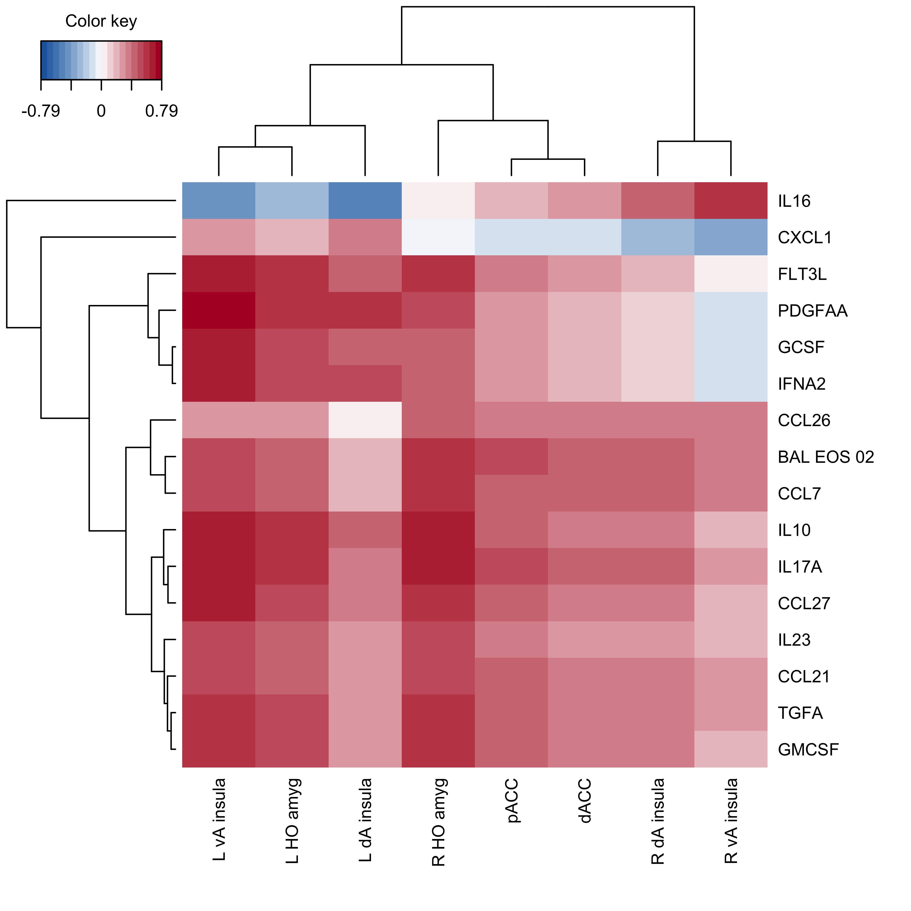

# Background

The purpose of this workflow is to associate gene module expression (EOS, NEUT) with host outcomes including:

* fMRI
* Lung function / asthma
* Protein

# Setup

Load packages

```{r message=FALSE, warning=FALSE}
# Data manipulation and figures
library(tidyverse)
library(readxl)
library(tidytext)
# RNAseq data
library(limma)
#Correlation
library(corrplot)
#PLS
library(mixOmics)
##  Be careful of version as this package if often not back compatible
#Enrichment MSigDB
library(SEARchways)
# Print pretty table to knit file
library(knitr)
library(kableExtra)
options(knitr.kable.NA = '')

`%notin%` <- Negate(`%in%`)
```

Set seed

```{r}
set.seed(4389)
```

Load functions

```{r}
source("scripts/corr.fxn.R")
```

# Load data

```{r}
load("data_clean/P337_BAL_data.RData")
```

# Format data

## Calculate V5 - V4

When applicable, correlations will be completed for delta values (V5-V4) to capture the paired nature of these data.

#### Module expression

Two donors are removed from BE expression data (MA1001 missing V4, MA1086 missing V5).

```{r message=FALSE}
#Read in all module expression
mod.files <- list.files(path="results/module_level/", pattern="mod_voom_counts",
                        recursive = TRUE, full.names = TRUE)

counts.mod <- data.frame()
for(file in mod.files){
  counts.temp <- read_csv(file) %>% 
    pivot_longer(-c(module,module.char), names_to="libID")
  
  counts.mod <- rbind(counts.mod, counts.temp)
}

#Calculate delta
counts.mod.delta <- counts.mod %>% 
  #Remove modules 00
  filter(!grepl("_00",module)) %>% 
  dplyr::select(-module.char) %>% 
  #Add metadata to denote V4, V5
  full_join(dplyr::select(dat.BAL.abund.norm.voom$targets, 
                   libID, donorID, visit), by = "libID") %>% 
  #separate V4 and V5
  dplyr::select(-libID) %>% 
  pivot_wider(names_from = visit) %>% 
  mutate(delta = V5-V4) %>% 
  #shorten module names
  mutate(module=gsub("module_P337_", "", module)) %>% 
  #wide format
  dplyr::select(-V4,-V5) %>% 
  arrange(donorID, module) %>% 
  pivot_wider(names_from = module, values_from = delta)
```

#### Cytokine protein

```{r message=FALSE}
plex.delta <- read_csv("data_raw/addtl.data/P337_BAL.multiplex.csv") %>% 
  rename(donorID=ptID, FGF2_V4=TGF2_V4) %>% 
  pivot_longer(-donorID) %>% 
  #Log10 transform
  mutate(value = log10(value)) %>% 
  separate(name, into=c("name","visit"), sep="_") %>% 
  pivot_wider(names_from = visit) %>% 
  mutate(delta = V5-V4) %>% 
  drop_na(delta) %>% 
  dplyr::select(-V4,-V5) %>% 
  arrange(name) %>% 
  mutate(name = paste(name, "multiplex", sep=".")) %>% 
  pivot_wider(values_from = delta) 
```

Check if cytokine genes are in expression modules as well.

```{r include=FALSE}
#List cytokines in multiplex data
cyto <- data.frame(cyto = gsub(".multiplex","", colnames(plex.delta)[-1]))

#Find cytokine gene names
key <- read_tsv("data_raw/EnsemblToHGNC_GRCh38.txt")
#cyto %>% filter(cyto %notin% key$hgnc_symbol)

#change to gene names where needed
cyto.rename <- cyto %>% 
  mutate(gene = recode(cyto,
                       "FLT3L"="FLT3LG",
                       "GCSF"="CSF3",
                       "GMCSF"="CSF2",
                       "IL12p70"="IL12A_IL12B",
                       "IL1RA"="IL1RN",
                       "IL23"="IL23A",
                       "IL8"="CXCL8",
                       "IP10"="CXCL10",
                       "PDGFAA"="PDGFA",
                       "PDGFAB"="PDGFA_PDGFB",
                       "RANTES"="CCL5",
                       "sCD40L"="CD40LG",
                       "TARC"="CCL17",
                       "TNFA"="TNF",
                       "TNFB"="LTA",
                       "VEGF"="VEGFA_VEGFB_VEGFC")) %>% 
  #Unnest multi-annotations
  separate(gene, into=c("a","b","c"), sep="_") %>% 
  pivot_longer(a:c, values_to = "gene") %>% 
  drop_na(gene) %>% 
  dplyr::select(-name)

#Check all renamed cytokines in key
table(cyto.rename$gene %in% key$hgnc_symbol)
```

```{r echo=FALSE, message=FALSE}
#genes in modules, NEUT
temp <- read_csv("results/module_level/module_P337_BAL_NEUT.pct_deepSplit2_minMod50/P337_BAL_NEUT.pct_genes_in_mod.csv") %>% 
  inner_join(cyto.rename, c("hgnc_symbol"="gene")) %>% 
  mutate(module = paste("NEUT", module.char, sep="_")) %>% 
  dplyr::select(module, hgnc_symbol, cyto) %>% 
  arrange(module, cyto)

#genes in modules, EOS
read_csv("results/module_level/module_P337_BAL_EOS.pct_deepSplit2_minMod50/P337_BAL_EOS.pct_genes_in_mod.csv") %>% 
  inner_join(cyto.rename, c("hgnc_symbol"="gene")) %>% 
  mutate(module = paste("EOS", module.char, sep="_")) %>% 
  dplyr::select(module, hgnc_symbol, cyto) %>% 
  arrange(module, cyto) %>% 
  bind_rows(temp) %>% 
  
  
  kable(align="c", col.names = c("Module", "Gene HGNC", 
                                 "Cytokine")) %>% 
  kable_styling(bootstrap_options = "striped", full_width = FALSE) %>% 
  collapse_rows(1, valign="top")
```

#### fMRI

Donor MA1012 is removed due to movement issues in fMRI.

```{r message=FALSE}
#Time point 1 = visit 4
neuro <- read_excel(sheet="T1",
  "data_raw/addtl.data/extraced.clusters.Matt.Altman_wbaseline_psychdata.xlsx") %>% 
  #long format
  pivot_longer(-idnum, names_to="neuro") %>% 
  #add visit variable
  mutate(visit="V4")

#Time point 2 = visit 5
neuro <- read_excel(sheet="T2",
  "data_raw/addtl.data/extraced.clusters.Matt.Altman_wbaseline_psychdata.xlsx") %>% 
  #long format
  pivot_longer(-idnum, names_to="neuro") %>% 
  #add visit variable
  mutate(visit="V5") %>% 
  #Combine with other visit
  full_join(neuro) %>% 
  #Format idnum to match RNAseq data
  mutate(idnum = paste("MA",idnum, sep="")) %>% 
  rename(donorID=idnum)

neuro.delta <- neuro %>% 
  filter(donorID != "MA1012" & neuro != "LSI" & neuro != "BDI") %>% 
  #Calculate delta
  pivot_wider(names_from = visit) %>% 
  mutate(delta = V5-V4) %>% 
  #remove fxnal metrics
  filter(!grepl("3way",neuro) & !grepl("LPR", neuro)) %>% 
  #fix name
  mutate(neuro = gsub("amgy","amyg",neuro)) %>% 
  #wide format
  dplyr::select(-V4,-V5) %>% 
  pivot_wider(names_from = neuro, values_from = delta) 
```

# Partial least squares (PLS)

Regression mode: Y matrix is deflated with respect to information extracted/modeled from local regression on X. Here, the goal is to predict Y from X (and vice versa).

Sparse: simultaneous variable selection in X and Y with LASSO penalization on each pair of loading vectors

<http://mixomics.org/methods/spls/>

## fMRI ~ module expression + cytokine protein

Format data

```{r message=FALSE}
X <- counts.mod.delta %>% 
  filter(donorID %in% neuro.delta$donorID) %>% 
  rename_all(~gsub(".pct","",.)) %>% 
  rename_all(~gsub("_"," ",.)) %>% 
  full_join(plex.delta) %>% 
  rename_all(~gsub(".multiplex","",.)) %>% 
  column_to_rownames("donorID")
X <- X[complete.cases(X),]
 
Y <- neuro.delta %>% 
  filter(donorID %in% rownames(X)) %>%
  rename_all(~gsub("_"," ",.)) %>% 
  column_to_rownames("donorID")

##Check order
identical(rownames(X),rownames(Y))
```

Perform SPLS regression.

```{r}
ncomp = 10
#SPLS
spls <- spls(X, Y, ncomp = ncomp, mode = "regression")  
```

### Tuning

#### Number of components

Compute evaluation criteria for SPLS.

```{r}
spls.Q2 <- perf(spls, validation = "Mfold", folds = 10, nrepeat = 100,
                progressBar = FALSE)
```

Q2 total is the sum of the quality of fit over all variables. In general, components should only continue to be added if Q^2^ \< 0.0975 (red line). After that, there are diminishing returns to adding more components. Here, all Q^2^ are negative, indicating that no components are particularly good fits for Y. This often occurs with complex, multi-variable Y outcomes and/or small sample sizes, both of which we have here.

```{r echo=FALSE}
mutate(as.data.frame(spls.Q2$measures$Q2.total$summary),
       method="SPLS")  %>% 

  ggplot(aes(x=comp, y=mean)) +
  geom_point() +
  geom_hline(yintercept = 0.0975, color="red") +
  facet_wrap(~method) +
  theme_classic() +
  scale_x_continuous(breaks=seq(1,10,1)) +
  labs(y= "Mean Q2 total", x="Component")
```

Thus, axis loadings will be assessed as well. Looking at the axis loadings, component 1 explains the most variation (\~40%) in X with further components contributing to a lesser extent (\<10%). Y shows more even contributions from components 1-3 being \> 25%.

```{r echo=FALSE}
#axis loadings
as.data.frame(spls$prop_expl_var)%>% 
  mutate(Component = c(1:ncomp)) %>% 
  pivot_longer(X:Y, names_to = "space") %>% 
  
  ggplot(aes(x=Component, y=value)) +
  geom_point() +
  facet_wrap(~space) +
  theme_classic() +
  labs(y="Loading") +
  scale_x_continuous(breaks=seq(1,10,1)) +
  geom_vline(xintercept = 3, lty="dashed", color="red")
```

```{r echo=FALSE}
ncompX <- 3
ncompY <- 3
```

Taken together, `r ncompX` X and `r ncompY` Y components will be assessed, though likely only 2 components will be used in the final model.

#### Number of variables

Compute error and fit metrics for variables on each component. The goal is to minimize error while maximizing correlation.

* mean average error (MAE): average magnitude of absolute model error
* bias: average difference between Y predictions and actual Y observations

```{r eval=FALSE, echo=FALSE}
for(tune.measure in c('cor','RSS')){
  print(tune.measure)
#X variables
spls.tune.X <- tune.spls(X, Y,
                        ncomp = ncompX, #Determined above
                        test.keepX = c(1:10,20,30,40,50,64),
                        validation = "Mfold",
                        folds = 10, nrepeat = 100,
                        progressBar = TRUE,
                        measure=tune.measure)
#Y variables
spls.tune.Y <- tune.spls(Y, X,
                        ncomp = ncompY, #Determined above
                        test.keepX = c(1:8),
                        validation = "Mfold", 
                        folds = 10, nrepeat = 10, 
                        progressBar = TRUE, 
                        measure = tune.measure)
assign(paste("spls",tune.measure,"X", sep="."), spls.tune.X, envir=.GlobalEnv)
assign(paste("spls",tune.measure,"Y", sep="."), spls.tune.Y, envir=.GlobalEnv)

rm(spls.tune.X, spls.tune.Y)
}
#Save all
dir.create("results/PLS/", showWarnings = FALSE)
save(list=ls(pattern="spls."),
     file="results/PLS/spls.tune2.RData")
```

```{r echo=FALSE, results=FALSE}
#Load in saved tuning to speed Rmd
load("results/PLS/spls.tune2.RData")
```

##### X-variables

Tuning suggests about 20 variables on component 1 and all 64 on component 2.

```{r echo=FALSE, fig.height=3}
plot(spls.cor.X, legend.position = 'topright')
plot(spls.RSS.X, legend.position = 'topright')
```

```{r eval=FALSE, echo=FALSE}
for(tune.measure in c('cor','RSS')){
  print(tune.measure)
#X variables
spls.tune.X <- tune.spls(X, Y,
                        ncomp = ncompX, #Determined above
                        test.keepX = c(1:30,64),
                        validation = "Mfold",
                        folds = 10, nrepeat = 100,
                        progressBar = TRUE,
                        measure = tune.measure)
assign(paste("spls.zoom",tune.measure,"X", sep="."), spls.tune.X, envir=.GlobalEnv)

rm(spls.tune.X)
}

#Save all
save(list=ls(pattern="spls.zoom"),
     file="results/PLS/spls.tune2.zoom.RData")
```

```{r echo=FALSE, results=FALSE}
#Load in saved MAE to speed Rmd
load("results/PLS/spls.tune2.zoom.RData")
```

Zooming in around 20, we see that that the actual component 1 correlation suggested number of variables is `r spls.zoom.cor.X$choice.keepX[1]` and RSS suggested is `r spls.zoom.RSS.X$choice.keepX[1]`. In addition, there is a local correlation maximum for component 2 at only 2 x-variables and no appreciable change in correlation from 2 to 30 variables. This suggests that the local maximum is sufficient for component 2.

```{r echo=FALSE, fig.height=3}
plot(spls.zoom.cor.X, legend.position = 'topright')
plot(spls.zoom.RSS.X, legend.position = 'topright')
```

##### Y-variables

Tuning suggested `r spls.RSS.Y$choice.keepX[1]` - `r spls.cor.Y$choice.keepX[1]` Y variables on component 1 and `r spls.RSS.Y$choice.keepX[2]` - `r spls.cor.Y$choice.keepX[2]` Y variables on component 2. Since the Y space is not very large (8 variables), all will be used in analysis.

```{r echo=FALSE, fig.height=3}
plot(spls.cor.Y, legend.position = 'topright') + labs(x="keepY")
plot(spls.RSS.Y, legend.position = 'topright') + labs(x="keepY")
```

Thus, the following numbers variables will be used. Note that for X, component 1 is reduced from the RSS suggested value (`r spls.zoom.RSS.X$choice.keepX[1]`) to 14 as this it the first lower maximum and does not differ much in RSS value. 

Additionally, we will restrict analyses to components 1-2 as component 3 consistently supports only 1 X and 1 Y variable, and therefore, does not explain much of the data.

```{r echo=FALSE}
data.frame(space = c("X","X","Y","Y"),
           component = c(1,2,1,2),
           features = c(14, 2, 8, 8)) %>% 
kable() %>%
kable_styling(bootstrap_options = "striped", full_width = FALSE)
```

### Run SPLS

Using the parameters determined above, run the final SPLS regression.

```{r}
result.spls <- spls(X,Y, 
                    keepX = c(14, 2),
                    keepY = c(8,8),
                    ncomp = 2, mode = "regression")  

#Save
save(spls, result.spls, file="results/PLS/SPLS.RData")
```

This results in the following variables across 2 components.

```{r echo=FALSE, fig.width=8.5, fig.height=8.5}
loadX <- as.data.frame(result.spls$loadings$X) %>% 
  rownames_to_column("var") %>% 
  mutate(space="X")

as.data.frame(result.spls$loadings$Y) %>% 
  rownames_to_column("var") %>% 
  mutate(space="Y") %>% 
  bind_rows(loadX) %>% 
  pivot_longer(comp1:comp2, names_to = "comp") %>% 
  mutate(name = ifelse(space=="X" & comp=="comp1", 
                       paste("X\nComponent 1 = ", 
                             round(result.spls$explained_variance$X[1]*100,
                                   digits=1), 
                             "%", sep=""),
                ifelse(space=="X" & comp=="comp2", 
                      paste("X\nComponent 2 = ",
                            round(result.spls$explained_variance$X[2]*100,
                                  digits=1),
                            "%", sep=""),
                ifelse(space=="Y" & comp=="comp1", 
                      paste("Y\nComponent 1 = ",
                            round(result.spls$explained_variance$Y[1]*100,
                                  digits=1), 
                            "%", sep=""),
                ifelse(space=="Y" & comp=="comp2", 
                      paste("Y\nComponent 2 = ",
                            round(result.spls$explained_variance$Y[2]*100,
                                  digits=1),
                            "%", sep=""),
                      NA))))) %>% 
  filter(value != 0) %>% 
  mutate(var = gsub(".multiplex|.pct","",var)) %>% 
  
  ggplot(aes(x=reorder_within(var, -value, list(name, space)), 
             y=value, fill=comp)) +
  geom_bar(position = position_dodge2(width = 0.9, preserve = "single"),
           stat="identity") +
  scale_x_reordered() +
  coord_flip() + 
  theme_classic() +
  facet_wrap(~name, scales="free", ncol=2) +
  labs(x="Selected variable", y="Loading", fill="") +
  theme(legend.position = "none")
```

Correlations within SPLS

```{r echo=FALSE}
cols <- colorRampPalette(c("#2166ac","white","#b2182b"))
cim(result.spls, comp = 1:2, margins = c(7, 7), 
    color=cols(20),
    save="png", name.save = "figs/P337_SPLS.fMRI_mod.plex.corr")
```



Correlation of PCs

```{r echo=FALSE}
cor(spls$variates$X[, 1:2], spls$variates$Y[, 1:2]) %>% 
  kable() %>% 
  kable_styling(bootstrap_options = "striped", full_width = FALSE) %>% 
  add_header_above(c(" ","Y"=2)) %>% 
  pack_rows("X",1,2)
```

### Enrichment

Determine Broad term enrichment in sPLS selected genes and proteins in the STRING network.

```{r}
gene.list <- list()
#Main STRING cluster
gene.list[["STRING.cluster"]] <- read_csv("publication/STRING.genes.csv") %>% 
  distinct(gene) %>% unlist(use.names = FALSE)
```

#### Hallmark (H)

```{r h.1, warning=FALSE, message=FALSE, results=FALSE}
H <- BIGprofiler(gene_list = gene.list, 
                ID="SYMBOL",
                category = "H",
                species = "human")
H %>% 
  mutate(genes = as.character(genes)) %>% 
  write_csv("results/enrichment/enrich_sPLS_H.csv")
```

#### Curated gene sets (C2 CP)

```{r c2.1, warning=FALSE, message=FALSE, results=FALSE}
c2 <- BIGprofiler(gene_list = gene.list, 
                ID="SYMBOL",
                category = "C2", subcategory = "CP",
                species = "human")
c2 %>% 
  mutate(genes = as.character(genes)) %>% 
  write_csv("results/enrichment/enrich_sPLS_C2_CP.csv")
```

#### Gene ontology (C5)

```{r c5, warning=FALSE, message=FALSE, results=FALSE}
c5 <- BIGprofiler(gene_list = gene.list, 
                ID="SYMBOL",
                category = "C5", subcategory = "GO:BP",
                species = "human")
c5 %>% 
  mutate(genes = as.character(genes)) %>% 
  write_csv("results/enrichment/enrich_sPLS_C5_GO.BP.csv")
```

#### Immunologic (C7)

```{r c7, warning=FALSE, message=FALSE, results=FALSE}
c7 <- BIGprofiler(gene_list = gene.list, 
                ID="SYMBOL",
                category = "C7",
                species = "human")
c7 %>% 
  mutate(genes = as.character(genes)) %>% 
  write_csv("results/enrichment/enrich_sPLS_C7.csv")
```

#### Enrichment results

Top 10 terms for each gene set group.

```{r echo=FALSE, message=FALSE}
bind_rows(H, c2, c5, c7) %>% 
  group_by(gs_cat, gs_subcat) %>% 
  slice_min(n=10, order_by = FDR) %>% 
  dplyr::select(gs_cat, gs_subcat, pathway, `k/K`, FDR) %>% 
  arrange(gs_cat, FDR) %>% 
  
  kable() %>% 
  kable_styling(bootstrap_options = "striped", full_width = FALSE) %>% 
  collapse_rows(1:2, valign="top")
```

# R session

```{r}
sessionInfo()
```

***